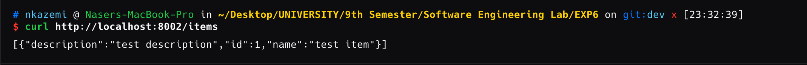
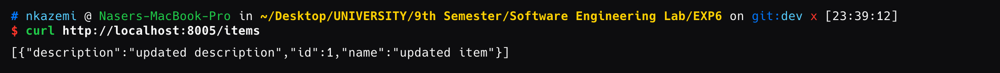

# آزمایش ۶
در این آزمایش به طراحی یک سیستم ساده‌ با امکان انجام CRUD با معماری micro-service می‌پردازیم و برای این منظور از docker استفاده خواهیم کرد.

## Backend Component
در ابتدا یک component برای backend تعریف و پیاده‌سازی می‌کنیم. این کار را با استفاده از Flask انجام می‌دهیم و یک سرور ساده با قابلیت اضافه کردن / حذف کردن / دریافت اطلاعات و آپدیت اطلاعات درمورد تعدادی item (مثلا کالاها یا هر آیتم دیگری) پیاده‌سازی می‌کنیم. هر آیتم دارای یک `name` و یک `description` است.

```bash
each item = {"name": "item_name", "description": "item_description"}
```

کد موجود برای پیاده‌سازی این component از کل سرویس مدنظرمان را در پوشه‌ی `backend/` می‌توانید مشاهده کنید. ضمنا یک dockerfile برای آن می‌نویسیم تا بتوانیم آنرا در قالب یک image بیلد کنیم و سپس در کنار سایر component ها توسط docker-compose بالا بیاوریم و اجرا کنیم.

```Dockerfile
FROM python:3.9-slim

WORKDIR /app

COPY requirements.txt .
RUN pip install --no-cache-dir -r requirements.txt

COPY app.py .

ENV PYTHONUNBUFFERED=1
ENV DB_HOST=postgres
ENV DB_NAME=postgres
ENV DB_USER=postgres
ENV DB_PASSWORD=postgres

EXPOSE 8000

CMD ["python3", "app.py"]
```
توضیحات مربوط به بخش docker-compose را در بخش مربوط به خودش می نویسیم و توضیح می‌دهیم. در ابتدا یک docker-compose ساده می‌نویسیم و آنرا اجرا می کنیم تا از صحت عملکرد component بک‌اند خود مطمین شویم:

```yaml
version: '3.8'

services:
  postgres:
    image: postgres:13
    environment:
      POSTGRES_DB: postgres
      POSTGRES_USER: postgres
      POSTGRES_PASSWORD: postgres
    ports:
      - "5433:5432"
    healthcheck:
      test: ["CMD-SHELL", "pg_isready -U postgres"]
      interval: 5s
      timeout: 5s
      retries: 5

  backend:
    build:
      context: ./backend
      dockerfile: Dockerfile
    ports:
      - "8000:8000"
    environment:
      - DB_HOST=postgres
      - DB_NAME=postgres
      - DB_USER=postgres
      - DB_PASSWORD=postgres
    depends_on:
      postgres:
        condition: service_healthy
```
با اجرای دستور `docker-compose up` می‌توانیم این سرویس را اجرا کنیم و از صحت عملکرد آن اطمینان حاصل کنیم.

```bash
sudo docker-compose up -d
```
و نتیجه بصورت زیر خواهد بود:

حالا با دستور زیر می‌بینیم که container های ما درحال اجرا هستند:
```bash
docker-compose ps
```


و حالا برای تست کردن، ابتدا یک table خالی برای item ها می‌سازیم:

```bash
docker-compose exec postgres psql -U postgres -c "CREATE TABLE IF NOT EXISTS items (id SERIAL PRIMARY KEY, name VARCHAR(100), description TEXT);"
```
و سپس به تست CRUD می‌پردازیم:

```bash
curl -X POST http://localhost:8000/items \
-H "Content-Type: application/json" \
-d '{"name":"test item","description":"test description"}'

curl -X POST http://localhost:8000/items \                                              
-H "Content-Type: application/json" \
-d '{"name":"second test item","description":"second test description"}'

curl http://localhost:8000/items        

curl http://localhost:8000/items/1           

curl -X PUT http://localhost:8000/items/1 \                                  
-H "Content-Type: application/json" \
-d '{"name":"updated item","description":"updated description"}'

curl http://localhost:8000/items        

curl -X DELETE http://localhost:8000/items/1  

curl http://localhost:8000/items
```

به ترتیب خروجی‌ها بصورت زیر اند:


همچنین با POSTMAN هم می‌توانیم راحت‌تر همین دستورات را تست کنیم. مثلا:


## Load Balancer (LB) Component
...

## Docker Compose

### توضیحات خط به خط فایل داکر کامپوز

#### نسخه فایل داکر کامپوز
```yaml
version: '3.8'
```
این خط نسخه داکر کامپوز را مشخص می‌کند. نسخه `3.8` یکی از نسخه‌های پایدار و متداول برای استفاده است.

---

#### سرویس‌ها (Services)
```yaml
services:
```
این بخش تعریف تمام سرویس‌هایی است که داکر کامپوز مدیریت خواهد کرد.

---

#### سرویس پایگاه داده PostgreSQL
```yaml
  postgres:
    image: postgres:13
```
- **`postgres`**: نام سرویس است که برای ارتباط با سرویس‌های دیگر استفاده می‌شود.
- **`image: postgres:13`**: ایمیج داکر PostgreSQL نسخه 13 را دانلود و اجرا می‌کند.

---

```yaml
    environment:
      POSTGRES_DB: postgres
      POSTGRES_USER: postgres
      POSTGRES_PASSWORD: postgres
```
- **`POSTGRES_DB`**: نام دیتابیس پیش‌فرض (در اینجا `postgres`).
- **`POSTGRES_USER`**: نام کاربر پایگاه داده (در اینجا `postgres`).
- **`POSTGRES_PASSWORD`**: رمز عبور پایگاه داده (در اینجا `postgres`).

---

```yaml
    ports:
      - "5433:5432"
```
- **`5433:5432`**: پورت `5432` که پورت پیش‌فرض PostgreSQL است، به پورت `5433` روی ماشین میزبان متصل می‌شود.

---

```yaml
    healthcheck:
      test: ["CMD-SHELL", "pg_isready -U postgres"]
      interval: 5s
      timeout: 5s
      retries: 5
```
- **`healthcheck`**: این قسمت وضعیت سلامت سرویس PostgreSQL را بررسی می‌کند.
  - **`test`**: دستور `pg_isready` اجرا می‌شود تا بررسی کند دیتابیس آماده است یا خیر.
  - **`interval`**: فاصله زمانی بین چک‌ها (5 ثانیه).
  - **`timeout`**: زمان انتظار برای پاسخ (5 ثانیه).
  - **`retries`**: تعداد تلاش‌ها (5 بار).

---

#### سرویس بک‌اند
```yaml
  backend:
    build:
      context: ./backend
      dockerfile: Dockerfile
```
- **`backend`**: نام سرویس برای اجرای اپلیکیشن بک‌اند.
- **`build`**:
  - **`context`**: دایرکتوری محلی که فایل‌های بک‌اند در آن قرار دارند.
  - **`dockerfile`**: فایل `Dockerfile` مورد استفاده برای ساخت ایمیج.

---

```yaml
    ports:
      - "8000:8000"
```
- **`8000:8000`**: پورت `8000` روی کانتینر به پورت `8000` روی ماشین میزبان متصل می‌شود.

---

```yaml
    environment:
      - DB_HOST=postgres
      - DB_NAME=postgres
      - DB_USER=postgres
      - DB_PASSWORD=postgres
```
- **`DB_HOST`**: آدرس سرویس پایگاه داده (در اینجا `postgres` که نام سرویس است).
- **`DB_NAME`**: نام دیتابیس (`postgres`).
- **`DB_USER`**: نام کاربر پایگاه داده (`postgres`).
- **`DB_PASSWORD`**: رمز عبور پایگاه داده (`postgres`).

---

```yaml
    depends_on:
      postgres:
        condition: service_healthy
```
- **`depends_on`**: مشخص می‌کند که این سرویس به سرویس `postgres` وابسته است.
- **`condition: service_healthy`**: سرویس `backend` فقط زمانی اجرا می‌شود که `postgres` سالم باشد.

---

#### فایل کامل

```yaml
version: '3.8'

services:
  postgres:
    image: postgres:13
    environment:
      POSTGRES_DB: postgres
      POSTGRES_USER: postgres
      POSTGRES_PASSWORD: postgres
    ports:
      - "5433:5432"
    healthcheck:
      test: ["CMD-SHELL", "pg_isready -U postgres"]
      interval: 5s
      timeout: 5s
      retries: 5

  backend1:
    build:
      context: ./backend
      dockerfile: Dockerfile
    ports:
      - "8001:8000"
    environment:
      - DB_HOST=postgres
      - DB_NAME=postgres
      - DB_USER=postgres
      - DB_PASSWORD=postgres
    depends_on:
      postgres:
        condition: service_healthy

  backend2:
    build:
      context: ./backend
      dockerfile: Dockerfile
    ports:
      - "8002:8000"
    environment:
      - DB_HOST=postgres
      - DB_NAME=postgres
      - DB_USER=postgres
      - DB_PASSWORD=postgres
    depends_on:
      postgres:
        condition: service_healthy

  backend3:
    build:
      context: ./backend
      dockerfile: Dockerfile
    ports:
      - "8003:8000"
    environment:
      - DB_HOST=postgres
      - DB_NAME=postgres
      - DB_USER=postgres
      - DB_PASSWORD=postgres
    depends_on:
      postgres:
        condition: service_healthy
```


برای اینکه چند `instance` از `backend` که به یک `database` وصل هستند بالا بیاوریم، در صورتی که Load Balancer نداشته باشیم، برای هر کدام یک config جدا تعریف می‌کنیم.

در اینجا نمونه‌هایی از عملکرد صحیح Service در این حالت را مشاهده می‌کنیم.








#### بخش deploy برای مقیاس‌پذیری سرویس

```yaml
    deploy:
      replicas: 3
      restart_policy:
        condition: on-failure
```

- **`deploy`**: این بخش برای تعریف تنظیمات مربوط به نحوه اجرای سرویس استفاده می‌شود. این ویژگی در **Swarm Mode** قابل استفاده است.

---

### توضیحات جزئی‌تر

#### `replicas: 3`
- تعداد نسخه‌هایی از سرویس که باید اجرا شوند.
- در اینجا، مقدار `3` مشخص می‌کند که سه نسخه از سرویس `backend` اجرا می‌شوند.

---

#### `restart_policy`
- سیاست بازراه‌اندازی کانتینرها در صورت خطا.

##### `condition: on-failure`
- شرط بازراه‌اندازی: کانتینر تنها در صورتی که به دلیل خطا متوقف شود، دوباره اجرا خواهد شد.

---

### نکات مهم
1. **Swarm Mode**:
   - این بخش فقط در حالت Swarm داکر کار می‌کند.
   - برای فعال کردن Swarm Mode، از دستور زیر استفاده کنید:
     ```bash
     docker swarm init
     ```

2. **بارگذاری و تعادل‌سازی (Load Balancing)**:
   - در حالت Swarm، داکر به‌صورت خودکار درخواست‌ها را بین نسخه‌های مختلف سرویس (replicas) توزیع می‌کند.

---

## Results of running complete system
...
