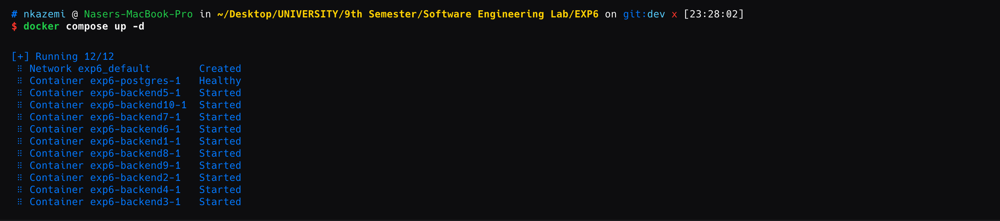

# آزمایش ۶
در این آزمایش به طراحی یک سیستم ساده‌ با امکان انجام CRUD با معماری micro-service می‌پردازیم و برای این منظور از docker استفاده خواهیم کرد.

## Backend Component
در ابتدا یک component برای backend تعریف و پیاده‌سازی می‌کنیم. این کار را با استفاده از Flask انجام می‌دهیم و یک سرور ساده با قابلیت اضافه کردن / حذف کردن / دریافت اطلاعات و آپدیت اطلاعات درمورد تعدادی item (مثلا کالاها یا هر آیتم دیگری) پیاده‌سازی می‌کنیم. هر آیتم دارای یک `name` و یک `description` است.

```bash
each item = {"name": "item_name", "description": "item_description"}
```

کد موجود برای پیاده‌سازی این component از کل سرویس مدنظرمان را در پوشه‌ی `backend/` می‌توانید مشاهده کنید. ضمنا یک dockerfile برای آن می‌نویسیم تا بتوانیم آنرا در قالب یک image بیلد کنیم و سپس در کنار سایر component ها توسط docker-compose بالا بیاوریم و اجرا کنیم.

```Dockerfile
FROM python:3.9-slim

WORKDIR /app

COPY requirements.txt .
RUN pip install --no-cache-dir -r requirements.txt

COPY app.py .

ENV PYTHONUNBUFFERED=1
ENV DB_HOST=postgres
ENV DB_NAME=postgres
ENV DB_USER=postgres
ENV DB_PASSWORD=postgres

EXPOSE 8000

CMD ["python3", "app.py"]
```
توضیحات مربوط به بخش docker-compose را در بخش مربوط به خودش می نویسیم و توضیح می‌دهیم. در ابتدا یک docker-compose ساده می‌نویسیم و آنرا اجرا می کنیم تا از صحت عملکرد component بک‌اند خود مطمین شویم:

```yaml
version: '3.8'

services:
  postgres:
    image: postgres:13
    environment:
      POSTGRES_DB: postgres
      POSTGRES_USER: postgres
      POSTGRES_PASSWORD: postgres
    ports:
      - "5433:5432"
    healthcheck:
      test: ["CMD-SHELL", "pg_isready -U postgres"]
      interval: 5s
      timeout: 5s
      retries: 5

  backend:
    build:
      context: ./backend
      dockerfile: Dockerfile
    ports:
      - "8000:8000"
    environment:
      - DB_HOST=postgres
      - DB_NAME=postgres
      - DB_USER=postgres
      - DB_PASSWORD=postgres
    depends_on:
      postgres:
        condition: service_healthy
```
با اجرای دستور `docker-compose up` می‌توانیم این سرویس را اجرا کنیم و از صحت عملکرد آن اطمینان حاصل کنیم.

```bash
sudo docker-compose up -d
```
و نتیجه بصورت زیر خواهد بود:

حالا با دستور زیر می‌بینیم که container های ما درحال اجرا هستند:
```bash
docker-compose ps
```


و حالا برای تست کردن، ابتدا یک table خالی برای item ها می‌سازیم:

```bash
docker-compose exec postgres psql -U postgres -c "CREATE TABLE IF NOT EXISTS items (id SERIAL PRIMARY KEY, name VARCHAR(100), description TEXT);"
```
و سپس به تست CRUD می‌پردازیم:

```bash
curl -X POST http://localhost:8000/items \
-H "Content-Type: application/json" \
-d '{"name":"test item","description":"test description"}'

curl -X POST http://localhost:8000/items \                                              
-H "Content-Type: application/json" \
-d '{"name":"second test item","description":"second test description"}'

curl http://localhost:8000/items        

curl http://localhost:8000/items/1           

curl -X PUT http://localhost:8000/items/1 \                                  
-H "Content-Type: application/json" \
-d '{"name":"updated item","description":"updated description"}'

curl http://localhost:8000/items        

curl -X DELETE http://localhost:8000/items/1  

curl http://localhost:8000/items
```

به ترتیب خروجی‌ها بصورت زیر اند:


همچنین با POSTMAN هم می‌توانیم راحت‌تر همین دستورات را تست کنیم. مثلا:


## Load Balancer (LB) Component
از لود بالانسر آماده nginx استفاده کردیم فایل کانفیگ آن مطابق روبرو است.
```conf
worker_processes 1;

events {
    worker_connections 1024;
}

http {
    upstream backend_servers {
        server backend:8000; # Load Balancer درخواست‌ها را به سرورهای Backend ارسال می‌کند
    }

    server {
        listen 80;

        location / {
            proxy_pass http://backend_servers;
            proxy_set_header Host $host;
            proxy_set_header X-Real-IP $remote_addr;
            proxy_set_header X-Forwarded-For $proxy_add_x_forwarded_for;
        }
    }
}

```


## Docker Compose

این فایل `docker-compose` یک پروژه‌ی چند سرویسی را تعریف می‌کند. در ادامه هر خط توضیح داده شده است:

### سطح بالا:

```yaml
version: '3.8'
```

- **`version`**: نسخه‌ای از Docker Compose است که استفاده می‌شود. نسخه 3.8 از ویژگی‌های پیشرفته‌تر مانند `healthcheck` پشتیبانی می‌کند.

---

### سرویس‌ها:

#### 1. **`postgres`**:

```yaml
services:
  postgres:
    image: postgres:13
```

- **`services`**: تعریف سرویس‌ها.
- **`postgres`**: نام سرویس که دیتابیس PostgreSQL است.
- **`image`**: تصویر داکری که استفاده می‌شود. اینجا از نسخه‌ی 13 PostgreSQL استفاده شده است.

```yaml
    environment:
      POSTGRES_DB: postgres
      POSTGRES_USER: postgres
      POSTGRES_PASSWORD: postgres
```

- **`environment`**: تنظیم متغیرهای محیطی برای پیکربندی دیتابیس.
  - **`POSTGRES_DB`**: نام دیتابیس.
  - **`POSTGRES_USER`**: نام کاربری دیتابیس.
  - **`POSTGRES_PASSWORD`**: رمز عبور کاربر.

```yaml
    ports:
      - "5433:5432"
```

- **`ports`**: پورت 5432 (پورت پیش‌فرض PostgreSQL) به پورت 5433 ماشین میزبان مپ می‌شود.

```yaml
    healthcheck:
      test: [ "CMD-SHELL", "pg_isready -U postgres" ]
      interval: 5s
      timeout: 5s
      retries: 5
```

- **`healthcheck`**: بررسی سلامت سرویس.
  - **`test`**: از دستور `pg_isready` استفاده می‌کند تا بررسی کند آیا دیتابیس آماده است یا نه.
  - **`interval`**: فاصله زمانی بین هر بررسی (5 ثانیه).
  - **`timeout`**: حداکثر زمانی که یک بررسی باید طول بکشد (5 ثانیه).
  - **`retries`**: تعداد دفعات تلاش مجدد برای بررسی سلامت.

```yaml
    networks:
      - app-network
```

- **`networks`**: این سرویس در شبکه‌ای به نام `app-network` قرار می‌گیرد.

---

#### 2. **`backend`**:

```yaml
  backend:
    build:
      context: ./backend
      dockerfile: Dockerfile
```

- **`backend`**: سرویس مربوط به بخش پشتی (Backend).
- **`build`**: از یک دایرکتوری به نام `./backend` استفاده می‌کند تا ایمیج خود را از فایل `Dockerfile` بسازد.

```yaml
    ports:
      - "8000"
```

- **`ports`**: پورت 8000 برای سرویس backend باز می‌شود.

```yaml
    environment:
      - DB_HOST=postgres
      - DB_NAME=postgres
      - DB_USER=postgres
      - DB_PASSWORD=postgres
```

- **`environment`**: متغیرهای محیطی برای اتصال به دیتابیس (PostgreSQL) تنظیم می‌شود.

```yaml
    depends_on:
      postgres:
        condition: service_healthy
```

- **`depends_on`**: سرویس backend وابسته به سرویس `postgres` است و فقط وقتی اجرا می‌شود که دیتابیس در حالت سالم باشد.

```yaml
    deploy:
      replicas: 10
      update_config:
        parallelism: 1
        delay: 10s
      restart_policy:
        condition: on-failure
```

- **`deploy`**: تنظیمات مربوط به مدیریت توزیع و مقیاس‌پذیری.
  - **`replicas`**: تعداد نسخه‌های این سرویس (10 نسخه).
  - **`update_config`**: نحوه به‌روزرسانی نسخه‌ها:
    - **`parallelism`**: چند کانتینر همزمان به‌روزرسانی شوند (1 کانتینر در هر لحظه).
    - **`delay`**: فاصله زمانی بین به‌روزرسانی هر کانتینر (10 ثانیه).
  - **`restart_policy`**: اگر کانتینر به مشکل خورد، در صورت شکست، مجدداً راه‌اندازی می‌شود.

```yaml
    networks:
      - app-network
```

- **`networks`**: این سرویس هم به شبکه‌ی `app-network` متصل است.

---

#### 3. **`load-balancer`**:
```yaml
  load-balancer:
    build:
      context: ./loadbalancer
      dockerfile: Dockerfile
```

- **`load-balancer`**: سرویس متعادل‌کننده بار (Load Balancer).
- **`build`**: مشابه backend، ایمیج خود را از دایرکتوری `./loadbalancer` می‌سازد.

```yaml
    ports:
      - "8080:80"
```

- **`ports`**: پورت 80 کانتینر به پورت 8080 میزبان مپ می‌شود.

```yaml
    depends_on:
      - backend
```

- **`depends_on`**: این سرویس به `backend` وابسته است و فقط پس از اجرای موفقیت‌آمیز آن، اجرا می‌شود.

```yaml
    networks:
      - app-network
```

- **`networks`**: این سرویس نیز بخشی از شبکه‌ی `app-network` است.

---

### شبکه‌ها:
```yaml
networks:
  app-network:
    driver: bridge
```

- **`networks`**: یک شبکه به نام `app-network` تعریف شده است.
  - **`driver: bridge`**: نوع شبکه Bridge است که برای ارتباط کانتینرها در یک میزبان استفاده می‌شود.

---

#### فایل کامل

```yaml
version: '3.8'

services:
  postgres:
    image: postgres:13
    environment:
      POSTGRES_DB: postgres
      POSTGRES_USER: postgres
      POSTGRES_PASSWORD: postgres
    ports:
      - "5433:5432"
    healthcheck:
      test: [ "CMD-SHELL", "pg_isready -U postgres" ]
      interval: 5s
      timeout: 5s
      retries: 5
    networks:
      - app-network

  backend:
    build:
      context: ./backend
      dockerfile: Dockerfile
    ports:
      - "8000"
    environment:
      - DB_HOST=postgres
      - DB_NAME=postgres
      - DB_USER=postgres
      - DB_PASSWORD=postgres
    depends_on:
      postgres:
        condition: service_healthy
    deploy:
      replicas: 10
      update_config:
        parallelism: 1
        delay: 10s
      restart_policy:
        condition: on-failure
    networks:
      - app-network


  load-balancer:
    build:
      context: ./loadbalancer
      dockerfile: Dockerfile
    ports:
      - "8080:80"
    depends_on:
      - backend
    networks:
      - app-network

networks:
  app-network:
    driver: bridge
```

در اینجا نمونه‌هایی از عملکرد صحیح Service در این حالت را مشاهده می‌کنیم.




## Results of running complete system
در این قسمت به نتایج اجرای کامل سیستم می‌پردازیم. در ابتدا، یک تست ابتدایی نوشته‌ایم که چندین درخواست GET همزمان ارسال می‌کند که ببینیم load balancer چگونه این موارد را مدیریت می‌کند. کد تست بصورت زیر است:
  
```python
import requests
import time
from datetime import datetime


def make_request():
    try:
        response = requests.get("http://localhost:8080/items")
        timestamp = datetime.now().strftime("%H:%M:%S")
        if response.status_code == 200:
            print(f"[{timestamp}] Request successful")
            return True
        else:
            print(f"[{timestamp}] Error: Status code {response.status_code}")
            return False
    except requests.exceptions.ConnectionError:
        print(f"[{timestamp}] Connection failed - is the load balancer running?")
        return False
    except Exception as e:
        print(f"[{timestamp}] Unexpected error: {str(e)}")
        return False


def main():
    print("Starting load balance test...")
    successful_requests = 0

    for i in range(10):
        if make_request():
            successful_requests += 1
        time.sleep(1)

    print(f"\nCompleted: {successful_requests}/10 successful requests")


if __name__ == "__main__":
    main()
```
ضمنا خروجی این تست را در لاگ‌های docker با دستور `docker-compose logs -f` می‌توان دید:


و همچنین print های خود تست:


همچنین با دقت بیشتری توسط یک CLI مثل postman هم این را تست می‌کنیم. مثلا دو تا item جدید می‌سازیم:


و در لاگ‌ها مشاهده می‌کنیم که به ۱۰ سرور مختلف ارسال شده‌اند. از `exp6-backend-10` تا `exp6-backend-1`:

## نحوه بهبود سیسستم برای مدیریت لود بیشتر

برای اینکه سیستم بتواند لود بیشتری را تحمل کند، دو میکروسرویس `backend` و `load-balancer`  را به هم متصل می‌کنیم و چند instance از سرویس `backend` را اجرا می‌کنیم. در این صورت درخواست‌ها تنها از طریق interface میکروسرویس `loadbalancer` به `backend` به صورت تقسیم‌شده می‌رسند و به این شکل لود بین instanceها که در واقعیت می‌توانند روی سرورهای جدا باشند پخش می‌شود.


## پاسخ به سوالات

1. مفهوم stateless به حالتی اشاره دارد که در آن اپلیکیشن یا پروسه‌ای هیچ‌گونه اطلاعاتی از عملیات‌های قبلی ذخیره نمی‌کند. در هر درخواست (request)، تمام داده‌های موردنیاز برای پردازش باید به‌طور کامل ارائه شود زیرا هیچ تاریخچه یا وضعیت پیشین نگهداری نمی‌شود.

در آزمایش ما، استفاده از مفهوم stateless به این شکل بوده است که دو سرویس اضافه شده به سیستم، به صورت کاملاً مستقل و بدون وابستگی به یکدیگر عمل می‌کنند. هر سرویس به دیتابیس MongoDB متصل است و هیچ‌گونه اطلاعاتی را به اشتراک نمی‌گذارند یا پردازشی مشترک انجام نمی‌دهند. به این ترتیب، هر درخواست به عنوان یک عملیات مستقل پردازش می‌شود. استفاده از کانتینرهای داکر نیز با هدف ارائه استقلال و جداسازی کامل میکروسرویس‌ها طراحی شده که کاملاً با معماری stateless همخوانی دارد.

2. پاسخ به سوالات:

### ۱. مفهوم **stateless** چیست و چگونه از آن در آزمایش خود استفاده کرده‌ایم؟
**مفهوم stateless** به حالتی اشاره دارد که در آن اپلیکیشن یا پروسه‌ای هیچ‌گونه اطلاعاتی از عملیات‌های قبلی ذخیره نمی‌کند. در هر درخواست (request)، تمام داده‌های موردنیاز برای پردازش باید به‌طور کامل ارائه شود زیرا هیچ تاریخچه یا وضعیت پیشین نگهداری نمی‌شود. 

در آزمایش شما، **استفاده از مفهوم stateless** به این شکل بوده است که دو سرویس اضافه شده به سیستم، به صورت کاملاً مستقل و بدون وابستگی به یکدیگر عمل می‌کنند. هر سرویس به دیتابیس MongoDB متصل است و هیچ‌گونه اطلاعاتی را به اشتراک نمی‌گذارند یا پردازشی مشترک انجام نمی‌دهند. به این ترتیب، هر درخواست به عنوان یک عملیات مستقل پردازش می‌شود. استفاده از **کانتینرهای داکر** نیز با هدف ارائه استقلال و جداسازی کامل میکروسرویس‌ها طراحی شده که کاملاً با معماری stateless همخوانی دارد.

---

### ۲. تفاوت‌های **load balancing** در لایه ۴ و ۷ از مدل OSI چیست و مزایای آن‌ها چیست؟ در این آزمایش از کدام لایه استفاده شده است؟

#### تفاوت‌های لایه ۴ و لایه ۷ در **Load Balancing**:

1. **Load Balancing در لایه ۴**:
   - در این لایه، توزیع بار بر اساس اطلاعات شبکه‌ای نظیر **IP Address** و **پورت** انجام می‌شود.
   - هیچ اطلاعی از محتوای درخواست یا پاسخ وجود ندارد.
   - سریع‌تر و سبک‌تر است زیرا تنها به داده‌های مربوط به انتقال (Transport Layer) وابسته است.
   - **مزیت‌ها**:
     - کارایی بالا و تأخیر کمتر.
     - مناسب برای سرویس‌هایی که نیاز به پردازش زیاد ندارند.
   - **محدودیت‌ها**:
     - قابلیت تصمیم‌گیری پیچیده بر اساس محتوای درخواست یا کاربر را ندارد.

2. **Load Balancing در لایه ۷**:
   - در این لایه، توزیع بار بر اساس محتوای درخواست‌ها (مثلاً URL، هدرها، کوکی‌ها، و غیره) انجام می‌شود.
   - انعطاف‌پذیری بیشتری دارد و می‌تواند درخواست‌ها را به سرورهای خاص بر اساس نوع محتوا یا کاربر هدایت کند.
   - **مزیت‌ها**:
     - امکان استفاده از استراتژی‌های پیشرفته توزیع بار.
     - مناسب برای وب‌اپلیکیشن‌ها و سرویس‌هایی که نیاز به تحلیل محتوا دارند.
   - **محدودیت‌ها**:
     - پیچیدگی و سربار پردازشی بیشتر.

در آزمایش ما، از **load balancing در لایه ۷** استفاده شده است. دلیل این زیرا 